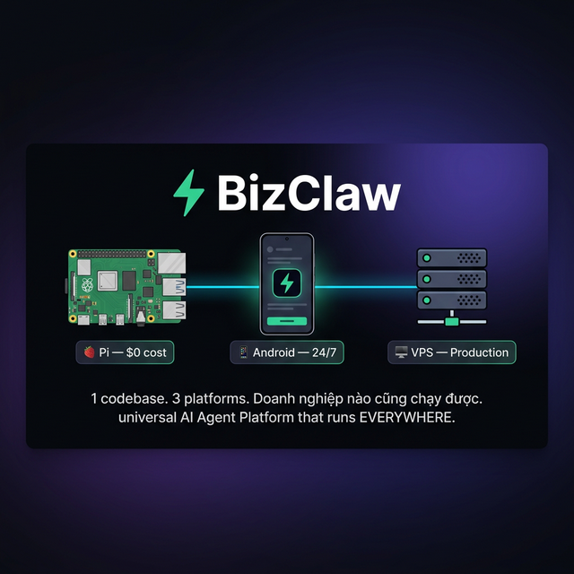
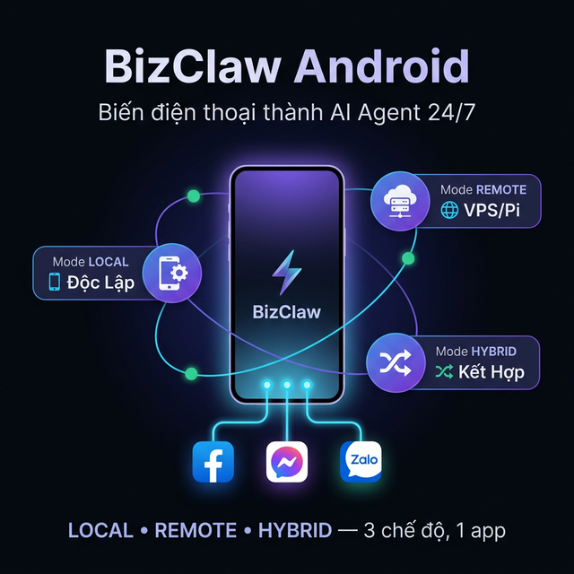

# ⚡ BizClaw — Trợ lý AI Cá Nhân cho Doanh Nghiệp

<p align="center">
  
</p>

<p align="center">
  <strong>AI Agent riêng — chạy trên thiết bị của bạn. Dữ liệu 100% thuộc về bạn.</strong><br>
  Raspberry Pi ($0) • Android (24/7) • Laptop / Mini PC
</p>

> **BizClaw** là nền tảng AI Agent self-hosted, viết hoàn toàn bằng Rust. Chạy trên bất kỳ thiết bị nào từ 512MB RAM — từ Raspberry Pi bỏ túi đến laptop cá nhân. Không cần cloud, không cần server.

[](https://www.rust-lang.org/)
[](LICENSE)
[]()
[](https://bizclaw.vn)
[](https://www.facebook.com/bizclaw.vn)

---

## 🎯 BizClaw dành cho ai?

| Đối tượng | Lợi ích |
|-----------|---------|
| 🧑‍💼 **Doanh nhân nhỏ** | AI trả lời khách hàng 24/7 qua Zalo, Telegram, Email |
| 💻 **Developer** | Self-hosted AI agent với 16 providers, 13 tools, MCP support |
| 🏪 **Cửa hàng / Quán** | AI hỗ trợ báo giá, lịch hẹn — chạy trên Raspberry Pi $0/tháng |
| 📱 **Người dùng Android** | Agent tự post Facebook, reply Messenger — offline 100% |

> 🔒 **Không telemetry. Không tracking. Không tạo tài khoản trên server trung gian.** Dữ liệu chat, API Keys mã hoá AES-256 trên ổ cứng của bạn.

---

## 🚀 Cài đặt — 3 cách

### Cách 1: Docker (Khuyên dùng)

```bash
git clone https://github.com/nguyenduchoai/bizclaw.git
cd bizclaw && docker-compose up -d
# → Dashboard tại http://localhost:3579
```

### Cách 2: Build từ Source

```bash
git clone https://github.com/nguyenduchoai/bizclaw.git
cd bizclaw && cargo build --release

# Cài đặt (wizard tương tác)
./target/release/bizclaw init

# Chạy agent + dashboard
./target/release/bizclaw serve
# → Dashboard tại http://localhost:3579
```

### Cách 3: One-Click Install (VPS / Raspberry Pi)

```bash
curl -sSL https://bizclaw.vn/install.sh | sudo bash
```

> 💡 **Chỉ cần 1 file `config.toml`** — không cần PostgreSQL, không cần Nginx, không cần domain.

---

## ✨ Tính năng chính

| Hạng mục | Chi tiết |
|----------|----------|
| **🔌 16 Providers** | OpenAI, Anthropic, Gemini, DeepSeek, Groq, OpenRouter, Together, MiniMax, xAI (Grok), Mistral, BytePlus ModelArk, Ollama, llama.cpp, Brain Engine, CLIProxy, vLLM |
| **💬 9 Channels** | CLI, Telegram, Discord, Email (IMAP/SMTP), Webhook, WhatsApp, Zalo (Personal + Official) |
| **🛠️ 13 Tools** | Shell, File, Edit File, Glob, Grep, Web Search, HTTP, Config Manager, Execute Code (9 ngôn ngữ), Plan, Group Summarizer, Calendar, Doc Reader |
| **🔗 MCP** | Model Context Protocol — kết nối MCP servers bên ngoài, mở rộng tools không giới hạn |
| **🧠 Brain Engine** | GGUF inference offline: mmap, quantization, Flash Attention, SIMD (ARM NEON, x86 AVX2) |
| **🤖 51 Agent Templates** | 13 danh mục nghiệp vụ HR, Sales, Finance, Marketing... cài 1 click |
| **📚 Knowledge RAG** | Upload tài liệu → AI tự tìm kiếm & trả lời dựa trên nội dung |
| **⏰ Scheduler** | Tác vụ hẹn giờ, agent tự chạy background |
| **🌐 Web Dashboard** | 20+ trang UI (VI/EN), WebSocket real-time, Full CRUD |
| **🔒 Bảo mật** | AES-256, Command allowlist, HMAC-SHA256, rate limiting |

---

## 🍓📱💻 Chạy trên mọi thiết bị

| Thiết bị | Chi phí | Use Case |
|----------|---------|----------|
| 🍓 **Raspberry Pi** | **$0/tháng** | Doanh nghiệp nhỏ, cá nhân — binary 12MB, 512MB RAM |
| 📱 **Android** | **$0/tháng** | Agent bỏ túi, điều khiển Facebook/Zalo — 24/7 |
| 💻 **Laptop / Mini PC** | **$0/tháng** | Agent mạnh mẽ, chạy nhiều model cùng lúc |

```
  Cùng 1 codebase Rust →  cargo build  →  chạy trên thiết bị bạn chọn
         │
   ┌─────┼──────────────┐
   ▼     ▼              ▼
  🍓 Pi  📱 Android      💻 Laptop
  $0     $0             $0
  1 agent Agent bỏ túi   Multi-agent
  Offline 24/7           Brain Engine
```

---

## 🧠 Ollama — Chạy AI Miễn Phí

> Không cần API key. Chạy model AI trên thiết bị, 100% miễn phí.

```bash
# Cài Ollama (1 lệnh)
curl -fsSL https://ollama.ai/install.sh | sh

# Pull model theo tài nguyên
ollama pull qwen3:0.6b    # 500MB — Pi 4, VPS $5
ollama pull qwen3          # 4.7GB — laptop, VPS 4GB+
ollama pull llama3.2       # 3.8GB — phổ biến nhất
```

| Thiết bị | RAM | Model khuyên dùng |
|----------|-----|-------------------|
| 🍓 Raspberry Pi 4 | 2-4GB | `qwen3:0.6b`, `tinyllama` |
| 💻 Laptop | 8GB+ | `qwen3`, `llama3.2` |
| 📱 Android | 4GB+ | GGUF via llama.cpp |

---

## 💰 Mỗi Agent chọn Provider riêng — Tiết kiệm 60-80%

> Thay vì dùng 1 provider đắt tiền cho mọi việc, hãy tối ưu theo từng vai trò:

```
  Agent           │  Provider             │  Chi phí      │  Lý do
  ────────────────┼───────────────────────┼───────────────┼─────────
  Dịch thuật      │  Ollama/qwen3         │  $0 (local)   │  Free
  Full-Stack Dev  │  Anthropic/claude     │  $$$          │  Mạnh
  Social Media    │  Gemini/flash         │  $            │  Nhanh
  Kế toán         │  DeepSeek/chat        │  $$           │  Giá tốt
  Helpdesk        │  Groq/llama-3.3-70b   │  $            │  Nhanh
  Nội bộ          │  Brain Engine         │  $0 (offline) │  Bảo mật
```

---

## 👥 Group Chat — Đội ngũ Agent cộng tác

```
Bạn: "Chuẩn bị pitch cho nhà đầu tư Series A"
  │
  ├── 🧑‍💼 Agent "Chiến lược" (Claude)  → Phân tích thị trường, USP
  ├── 📊 Agent "Tài chính" (DeepSeek)  → Unit economics, projections
  ├── 📣 Agent "Marketing" (Gemini)    → Brand story, go-to-market
  └── ⚖️ Agent "Pháp lý" (Groq)       → Term sheet, cap table
```

---

## 📱 Android Agent — Không chỉ chat, mà ĐIỀU KHIỂN

<p align="center">
  
</p>

| Mode | Mô tả |
|------|--------|
| 📱 LOCAL | llama.cpp on-device, AI điều khiển apps, $0, 100% offline |
| 🌐 REMOTE | Kết nối agent từ xa, chat & điều khiển |
| 🔀 HYBRID | Engine local + agent cloud cùng lúc |

**20 Device Tools:**

| Category | Tools |
|----------|-------|
| 📱 Social | `facebook_post`, `facebook_comment`, `messenger_reply`, `zalo_send` |
| 🖥️ Screen | `screen_read`, `screen_click`, `screen_type`, `screen_tap`, `screen_swipe` |
| 🔧 System | `open_app`, `open_url`, `device_info`, `press_back`, `press_home`, `notifications` |

> Tất cả chạy 100% offline. Không cần server, không API key.

---

## 🔗 MCP Support

```toml
# config.toml — mở rộng tools bằng MCP servers
[[mcp_servers]]
name = "pageindex"
command = "npx"
args = ["-y", "@pageindex/mcp"]

[[mcp_servers]]
name = "github"
command = "npx"
args = ["-y", "@modelcontextprotocol/server-github"]
```

---

## 🏗️ Kiến trúc

```
┌──────────────────────────────────────────────────┐
│         bizclaw (Gateway + Dashboard)             │
│  ┌────────────────────────────────────────┐       │
│  │ Axum HTTP + WebSocket + Dashboard UI   │       │
│  │ SQLite gateway.db (embedded)           │       │
│  └────────────────┬───────────────────────┘       │
│    ┌──────────────┼──────────────┐                │
│    ▼              ▼              ▼                │
│  bizclaw-agent  bizclaw-agent  bizclaw-agent      │
│  (Orchestrator manages N agents)                  │
│    ┌──────────────┼──────────────┐                │
│    ▼              ▼              ▼                │
│ 16 Providers   9 Channels    13 Tools + MCP       │
│    ▼              ▼              ▼                │
│ Memory         Security      Knowledge            │
│  (SQLite+FTS5) (Allowlist)   (RAG+FTS5)           │
│    ▼                                              │
│ Brain Engine (GGUF+SIMD) — offline inference      │
└──────────────────────────────────────────────────┘
```

---

## 📦 Crate Map

| Crate | Mô tả | Status |
|-------|--------|--------|
| `bizclaw-core` | Traits, types, config, errors | ✅ |
| `bizclaw-brain` | GGUF inference + SIMD | ✅ |
| `bizclaw-providers` | 16 LLM providers | ✅ |
| `bizclaw-channels` | 9 channel types | ✅ |
| `bizclaw-memory` | SQLite + FTS5, Brain workspace | ✅ |
| `bizclaw-tools` | 13 native tools + MCP bridge | ✅ |
| `bizclaw-mcp` | MCP client (JSON-RPC 2.0) | ✅ |
| `bizclaw-security` | AES-256, Sandbox | ✅ |
| `bizclaw-agent` | Think-Act-Observe loop | ✅ |
| `bizclaw-gateway` | HTTP + WS + Dashboard | ✅ |
| `bizclaw-knowledge` | Knowledge RAG | ✅ |
| `bizclaw-scheduler` | Scheduled tasks | ✅ |
| `bizclaw-ffi` | Android FFI layer | ✅ |

---

## ☁️ Muốn dùng bản Cloud?

> Nếu bạn không muốn tự cài đặt, hãy đăng ký **BizClaw Cloud** — chúng tôi lo hạ tầng, bạn chỉ cần cấu hình AI.

| | Self-Hosted (Repo này) | ☁️ Cloud |
|--|--|--|
| **Cài đặt** | Tự cài trên thiết bị | Không cần cài — dùng ngay |
| **Hạ tầng** | Bạn quản lý | Chúng tôi quản lý |
| **Cập nhật** | Tự pull & build | Tự động cập nhật |
| **Hỗ trợ** | Community (GitHub) | Hỗ trợ ưu tiên |
| **Giá** | **Miễn phí** | Theo gói |

👉 **Tìm hiểu thêm tại [bizclaw.vn](https://bizclaw.vn)** — tab "Cloud"

---

## 📊 Stats

| Metric | Value |
|--------|-------|
| **Language** | 100% Rust + Kotlin (Android) |
| **Crates** | 17 |
| **Lines of Code** | ~43,000 |
| **Tests** | 240 passing |
| **Clippy Warnings** | **0** ✅ |
| **Binary Size** | bizclaw 12MB |
| **Last Updated** | 2026-03-04 |

---

## 🇬🇧 English

### What is BizClaw?

BizClaw is a **self-hosted AI Agent platform** built entirely in Rust. Run AI agents on your own device — no cloud, no third-party servers. Your data stays with you.

### Quick Start

```bash
git clone https://github.com/nguyenduchoai/bizclaw.git
cd bizclaw && cargo build --release
./target/release/bizclaw init
./target/release/bizclaw serve
# Open http://localhost:3579
```

### Key Features

- **16 AI Providers** — OpenAI, Anthropic, Gemini, DeepSeek, Groq, Ollama, and more
- **9 Channels** — CLI, Telegram, Discord, Email, Webhook, WhatsApp, Zalo
- **13 Tools** + MCP support for unlimited extensions
- **51 Agent Templates** — Pre-built for HR, Sales, Finance, Marketing, Legal, IT
- **Android Agent** — On-device LLM with 20 device tools, runs offline
- **Knowledge RAG** — Upload documents, AI learns from your content
- **AES-256 Security** — Encrypted credentials, command allowlists

> ☁️ **Want the hosted version?** Visit [bizclaw.vn](https://bizclaw.vn) — Cloud tab.

---

## 🔗 Links

| | |
|--|--|
| 🌐 **Website** | [https://bizclaw.vn](https://bizclaw.vn) |
| 📘 **Fanpage** | [https://www.facebook.com/bizclaw.vn](https://www.facebook.com/bizclaw.vn) |
| 💻 **GitHub** | [https://github.com/nguyenduchoai/bizclaw](https://github.com/nguyenduchoai/bizclaw) |

---

## 📄 License

MIT License — see [LICENSE](LICENSE) for details.

---

**BizClaw** v0.3.0 — *AI riêng, chạy mọi nơi. / Your own AI, runs everywhere.*
