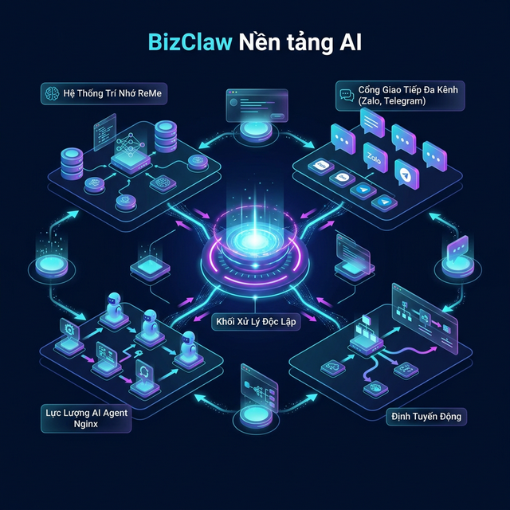

# ⚡ BizClaw — Trợ lý AI Cá Nhân cho Doanh Nghiệp

<p align="center">
  
</p>

<p align="center">
  <strong>AI Agent riêng — chạy trên thiết bị của bạn. Dữ liệu 100% thuộc về bạn.</strong><br>
  Raspberry Pi ($0) • Android (24/7) • Laptop / Mini PC
</p>

> **BizClaw** là nền tảng AI Agent self-hosted, viết hoàn toàn bằng Rust. Chạy trên bất kỳ thiết bị nào từ 512MB RAM — từ Raspberry Pi bỏ túi đến laptop cá nhân. Không cần cloud, không cần server.

[](https://www.rust-lang.org/)
[](LICENSE)
[]()
[]()
[](https://bizclaw.vn)
[](https://www.facebook.com/bizclaw.vn)

---

## 🎯 BizClaw dành cho ai?

| Đối tượng | Lợi ích |
|-----------|---------|
| 🧑‍💼 **Doanh nhân nhỏ** | AI trả lời khách hàng 24/7 qua Zalo, Telegram, Email |
| 💻 **Developer** | Self-hosted AI agent với 16 providers, 16+ tools, MCP support |
| 🏪 **Cửa hàng / Quán** | AI hỗ trợ báo giá, lịch hẹn — chạy trên Raspberry Pi $0/tháng |
| 📱 **Người dùng Android** | Nhắn tin nhờ Mama làm việc, Auto-Reply Zalo/Messenger/Telegram 24/7 — offline 100% |

> 🔒 **Không telemetry. Không tracking. Không tạo tài khoản trên server trung gian.** Dữ liệu chat, API Keys mã hoá AES-256 trên ổ cứng của bạn.

---

## 🧪 Dùng Thử Demo — Trải nghiệm ngay không cần cài đặt

> **Mục đích**: Học tập, nghiên cứu và thử nghiệm. Demo server chạy trên VPS thật để cộng đồng trải nghiệm toàn bộ tính năng trước khi tự host.

| Thông tin | Giá trị |
|-----------|---------|
| 🌐 **Demo Dashboard** | [https://apps.bizclaw.vn](https://apps.bizclaw.vn) |
| 🏠 **Landing Page** | [https://bizclaw.vn](https://bizclaw.vn) |
| 📧 **Email** | `admin@bizclaw.vn` |
| 🔑 **Password** | `BizClaw@Demo2026` |

```bash
# Hoặc truy cập domain phụ (cùng hệ thống):
# Dashboard:  https://apps.viagent.vn
# Landing:    https://viagent.vn
```

> ⚠️ **Lưu ý quan trọng:**
> - Đây là tài khoản **Admin** dùng chung cho cộng đồng — bạn sẽ thấy toàn bộ Dashboard, Agents, Providers, Channels, Knowledge Base, Scheduler...
> - **Không nhập API Key thật** vào demo server — hãy dùng Ollama (local, miễn phí) hoặc key test.
> - Demo server được **reset định kỳ** — dữ liệu tạo trên demo không được lưu trữ vĩnh viễn.
> - Muốn trải nghiệm đầy đủ với dữ liệu riêng? [Tự cài đặt](#-cài-đặt--5-cách) trên máy cá nhân (5 phút).

---

## 🚀 Cài đặt — 5 cách

### 🖥️ Cách 1: Desktop App (macOS / Windows / Linux)

> **Tải về, mở, dùng luôn — Zero config!**

| Platform | Download | Size |
|----------|----------|------|
| 🍎 **macOS** (Apple Silicon) | [📥 bizclaw-desktop-macos-arm64.dmg](https://github.com/nguyenduchoai/bizclaw/releases/latest/download/bizclaw-desktop-macos-arm64.dmg) | ~13MB |
| 🍎 **macOS** (Intel) | [📥 bizclaw-desktop-macos-x64.dmg](https://github.com/nguyenduchoai/bizclaw/releases/latest/download/bizclaw-desktop-macos-x64.dmg) | ~13MB |
| 🪟 **Windows** | [📥 bizclaw-desktop-windows-x64.zip](https://github.com/nguyenduchoai/bizclaw/releases/latest/download/bizclaw-desktop-windows-x64.zip) | ~12MB |
| 🐧 **Linux** (.deb) | [📥 bizclaw-desktop-linux-x64.deb](https://github.com/nguyenduchoai/bizclaw/releases/latest/download/bizclaw-desktop-linux-x64.deb) | ~12MB |

```bash
# macOS: Tải .dmg → Kéo vào Applications → Mở
# Windows: Giải nén → Chạy bizclaw-desktop.exe
# Linux:
sudo dpkg -i bizclaw-desktop-linux-x64.deb
bizclaw-desktop
# → Dashboard tự mở tại http://127.0.0.1:<port>
```

### 🔧 Cách 2: Build từ Source

```bash
git clone https://github.com/nguyenduchoai/bizclaw.git
cd bizclaw && cargo build --release

# Chạy Desktop app (auto-open browser)
./target/release/bizclaw-desktop

# Hoặc chạy CLI agent
./target/release/bizclaw init && ./target/release/bizclaw serve
# → Dashboard tại http://localhost:3000
```

### 🐳 Cách 3: Docker Standalone (1 Tenant)

```bash
git clone https://github.com/nguyenduchoai/bizclaw.git
cd bizclaw && docker-compose -f docker-compose.standalone.yml up -d
# → Dashboard tại http://localhost:3000
```

### 🌐 Cách 3b: Remote Access — Cloudflare Tunnel

> **Truy cập BizClaw từ xa** — chạy trên máy local, mở từ điện thoại/máy khác qua internet.

```bash
# Cài cloudflared (1 lần)
brew install cloudflared         # macOS
# hoặc: curl -L https://github.com/cloudflare/cloudflared/releases/latest/download/cloudflared-linux-amd64 -o /usr/local/bin/cloudflared

# Chạy BizClaw + Tunnel (1 lệnh)
./target/release/bizclaw serve --tunnel

# Output:
#   🌐 Dashboard: http://127.0.0.1:3000
#   ╔══════════════════════════════════════════════╗
#   ║  🌐 REMOTE ACCESS ENABLED                   ║
#   ║  https://xxx-xxx.trycloudflare.com           ║
#   ║  📱 Mở URL trên từ điện thoại/máy khác       ║
#   ╚══════════════════════════════════════════════╝
```

| Flag | Mô tả |
|------|--------|
| `bizclaw serve` | Chạy local, không tunnel |
| `bizclaw serve --tunnel` | Chạy local + tạo tunnel truy cập từ xa |
| `bizclaw serve --tunnel --open` | + tự mở browser |

> 💡 **Docker**: `docker-compose.standalone.yml` đã tích hợp sẵn container `cloudflared` — tự tạo tunnel khi start.

### 🌐 Cách 4: One-Click Install (VPS / Raspberry Pi)

```bash
curl -sSL https://bizclaw.vn/install.sh | sudo bash -s -- \
  --domain bot.company.vn \
  --admin-email admin@company.vn
# → Dashboard tại https://bot.company.vn
```

> 💡 **Chỉ cần 1 file `config.toml`** — không cần PostgreSQL, không cần Nginx, không cần domain.
> Database sử dụng SQLite embedded, mọi thứ chạy trong 1 binary duy nhất.

---

## ✨ Tính năng chính

| Hạng mục | Chi tiết |
|----------|----------|
| **🔌 18 Providers** | OpenAI, Anthropic, Gemini, DeepSeek, Groq, OpenRouter, Together, MiniMax, xAI (Grok), Mistral, BytePlus ModelArk, Cohere, Perplexity, DashScope/Qwen, Ollama, llama.cpp, Brain Engine, CLIProxy, vLLM |
| **💬 10 Channels** | CLI, Telegram, Discord, Email (IMAP/SMTP), Webhook, WhatsApp, Zalo (Personal + OA), **🎙️ Xiaozhi ESP32 Voice** |
| **🛠️ 16+ Tools** | Shell, File, Edit File, Glob, Grep, Web Search, HTTP, Config Manager, Plan, Group Summarizer, **Zalo Tool** (13 actions), Calendar, Doc Reader, **DB Schema** (auto-discover tables/columns), **DB Query** (MySQL/PostgreSQL/SQLite read-only), **API Connector** (safe WRITE via pre-configured endpoints), **Custom Tool** (agent self-creates) |
| **🔗 MCP** | Model Context Protocol — kết nối MCP servers bên ngoài, mở rộng tools không giới hạn |
| **🧠 Brain Engine** | GGUF inference offline: mmap, quantization, Flash Attention, SIMD (ARM NEON, x86 AVX2) |
| **🤖 Multi-Agent** | Tạo nhiều agent với vai trò khác nhau, gán vào kênh. Orchestrator quản lý N agents |
| **📚 Knowledge RAG** | Hybrid search (FTS5 + Vector). Multi-model embedding, Nudges, MCP server, Signal Logger (OpenClaw-RL), Folder Watcher, DOCX/PDF parser |
| **🖐️ Autonomous Hands** | Agent chạy background 24/7 — Research, Analytics, Content, Monitoring, Security. Tự retry, tự report |
| **🔄 Workflows** | 23 workflow templates có sẵn. Multi-step pipeline: Sequential, FanOut, Collect, Conditional, Loop, Transform |
| **⏰ Scheduler** | Cron, interval, one-time tasks. Agent tự chạy background, gửi kết quả qua Telegram/Zalo/Email/Webhook |
| **🎨 51 Agent Templates** | Gallery 13 danh mục nghiệp vụ: HR, Sales, Finance, Marketing, Legal, IT... cài 1 click |
| **🌐 Web Dashboard** | 20+ trang UI (VI/EN), modular lazy-loading, WebSocket real-time, Full CRUD, Dark/Light mode |
| **🎙️ Xiaozhi Voice** | Kết nối ESP32 Xiaozhi (~$5) làm AI Assistant vật lý. Voice → Agent → Voice. OpenAI-compatible API + Webhook. $0/tháng |
| **🔐 Vault** | Secret Vault (`vault://`) — mã hóa API keys at rest với AES-256-CBC. Config dùng `vault://key_name` → auto-resolve. CLI: `bizclaw vault set/get/list` |
| **✅ Approval Gates** | Human-in-the-loop cho tools nhạy cảm (shell, http_request). Submit → Approve/Deny/Expire. Enterprise compliance |
| **🛠️ Custom Tools** | Agent tự tạo tools (bash/python/node) cho task lặp lại. Hot-reload, sandboxed execution (env_clear), dangerous pattern validation |
| **📊 Progress Updates** | Mid-task status messaging — user thấy "🔍 Searching..." thay vì im lặng. ProgressSender trait cho channels |
| **🔒 Bảo mật** | AES-256 API key encryption, Vault URI scheme, RBAC 4-tier (Admin/Manager/User/Viewer), Prompt Injection Scanner (8 patterns, 80+ keywords, EN/VI/CN/JP/KR), SSRF Protection (IPv4+IPv6), Audit Trail, Per-IP rate limiting, HMAC-SHA256, Command allowlist, Runtime sandbox, Docker non-root user |
| **🖥️ Desktop App** | macOS (.dmg), Windows (.exe), Linux (.deb) — 13MB, auto-open browser, zero config |
| **☁️ Cloud Platform** | *(Bản Cloud)* Multi-tenant SaaS, PaaS remote nodes, JWT SSO, PostgreSQL — [bizclaw.vn](https://bizclaw.vn) |
| **⚡ Circuit Breaker** | Tự ngắt khi provider fail liên tục — exponential backoff, auto-recovery, zero downtime |
| **🎯 Model Router** | Auto-chọn model tối ưu theo complexity: Simple→Fast, Standard→Primary, Complex→Premium. Hỗ trợ `!fast` / `!best` override |

| **📊 Prometheus** | `/metrics` endpoint — 8 gauges/counters, OpenMetrics format, tích hợp Grafana |
| **📋 Audit Trail** | Ghi log toàn bộ thao tác: ai làm gì, lúc nào, cái gì — compliance SOC2/ISO 27001 |
| **💾 Backup/Restore** | Export/Import JSON — backup agents, channels, settings. Disaster recovery |
| **👑 RBAC** | 4 tầng phân quyền: Admin → Manager → User → Viewer. 60+ routes bảo vệ |
| **📊 RAG-from-DB** | AI tự khám phá DB → tự viết SQL → lấy data realtime → phân tích. Hỏi tiếng Việt, trả lời bằng data sống |
| **🏭 Industry Templates** | 3 template ngành (Bán lẻ, F&B, BĐS) — cài xong chạy luôn, không cần custom |
| **📅 Scheduled Reports** | Agent tự query + phân tích + gửi báo cáo mỗi sáng qua Telegram/Zalo/Email |
| **📱 Zalo Power Tool** | 13 actions: watch/unwatch nhóm + DM, tóm tắt nhóm/cá nhân, gửi tin nhắn, kết bạn, gửi báo cáo tới số chỉ định |

---

## 💼 Ứng Dụng RAG + Zalo cho Doanh Nghiệp SME

> **Biến BizClaw thành "bộ não" AI cho doanh nghiệp nhỏ & vừa** — kết nối dữ liệu nội bộ (RAG) với kênh giao tiếp hàng ngày (Zalo) để tạo ra giá trị thực, không chỉ là chatbot.

### 🎯 Case 1: CSKH Thông Minh — "AI biết tất cả về sản phẩm"

```
📚 RAG Knowledge Base           💬 Zalo Channel
┌─────────────────────┐         ┌─────────────────┐
│ Bảng giá sản phẩm   │         │ Khách hỏi Zalo: │
│ Chính sách bảo hành │ ──AI──► │ "Máy X giá bao  │
│ FAQ 200+ câu        │         │  nhiêu, bảo hành│
│ Hướng dẫn sử dụng   │         │  mấy năm?"      │
└─────────────────────┘         └─────────────────┘
                                        │
                                        ▼
                               "Máy X giá 15.9M,
                                bảo hành 24 tháng,
                                freeship nội thành"
```

**Hiệu quả:** Giảm 70% nhân sự CSKH, trả lời 24/7, không sai thông tin bảng giá.

### 🎯 Case 2: Quản Lý Nhóm Zalo — "AI tóm tắt, sếp đọc 2 phút"

```
  📱 Nhóm Zalo "Kinh Doanh"     📱 Nhóm "Kỹ Thuật"     📱 Nhóm "Kho Vận"
           │                            │                       │
           └────────────────────────────┼───────────────────────┘
                                        │
                                   🤖 BizClaw Agent
                                   (Zalo Tool: watch_group)
                                        │
                                   📊 AI Tóm Tắt
                                        │
                                   📨 Gửi báo cáo
                                        │
                                   📱 Sếp nhận Zalo DM:
                                   ┌────────────────────┐
                                   │ BÁO CÁO SÁNG NAY   │
                                   │                     │
                                   │ 📋 Nhóm KD:         │
                                   │ • 3 deal mới close   │
                                   │ • KH ABC phản hồi   │
                                   │                     │
                                   │ 🔧 Nhóm KT:         │
                                   │ • Bug #127 đã fix    │
                                   │ • Deploy v2.1 OK     │
                                   │                     │
                                   │ 📦 Kho:              │
                                   │ • Hết hàng SP-X      │
                                   │ • Đơn 50 box sáng    │
                                   └────────────────────┘
```

**Hiệu quả:** Sếp đọc 2 phút thay vì lướt 500+ tin nhắn. Không bỏ lỡ quyết định quan trọng.

### 🎯 Case 3: RAG-from-DB + Zalo = "Hỏi Doanh Thu Bằng Tiếng Việt"

```
📱 CEO nhắn Zalo: "Doanh thu tuần này so tuần trước?"
         │
         ▼
   🤖 Agent tự chạy pipeline:
   1️⃣ db_schema → Tìm bảng orders, payments
   2️⃣ db_query  → SELECT SUM(total) ... GROUP BY week
   3️⃣ AI phân tích → "Tuần này 280M, tăng 15% so tuần trước"
         │
         ▼
📱 CEO nhận Zalo: "📊 Tuần 10: 280M (+15%)
                    Top SP: Widget Pro (45M)
                    KH mới: 12 (tăng 20%)"
```

**Hiệu quả:** Không cần mở laptop, hỏi Zalo là có data. Real-time, chính xác 100%.

### 🎯 Case 4: Outreach & Kết Bạn Tự Động

```
🤖 Agent AI:
   1. Lấy danh sách lead từ file/CRM
   2. zalo_tool(action="send_friend_request", user_id="...", message="Chào anh/chị...")
   3. Sau khi accept → zalo_tool(action="send_message", content="Cảm ơn đã kết nối...")
   4. Theo dõi phản hồi → tóm tắt gửi về Sales Manager
```

**Hiệu quả:** Tự động kết nối 50-100 lead/ngày, follow-up không bỏ sót.

### 🎯 Case 5: Giám Sát DM Cá Nhân — "AI thay bạn đọc tin"

```
   📱 DM từ 10+ đối tác/khách hàng
           │
   🤖 Agent (watch_user cho từng người)
           │
   📊 Tóm tắt DM:
   "Anh A: hỏi về báo giá lô mới
    Chị B: xác nhận thanh toán
    Anh C: phàn nàn giao hàng chậm ← ⚠️ CẦN XỬ LÝ"
           │
   📨 Gửi báo cáo DM → Số Zalo sếp / nhân viên phụ trách
```

**Hiệu quả:** Không bỏ sót tin nhắn quan trọng dù có 100+ conversation.

### 📊 So Sánh: Trước vs Sau BizClaw

| Hạng mục | ❌ Trước (thủ công) | ✅ Sau (BizClaw) |
|----------|-------------------|------------------|
| CSKH | 2-3 nhân viên trực Zalo | AI trả lời 24/7, chính xác |
| Đọc tin nhóm | Sếp lướt 500+ tin/ngày | AI tóm tắt 2 phút |
| Báo cáo doanh thu | Kế toán xuất Excel, email | Hỏi Zalo, có ngay |
| Follow-up khách | Quên, bỏ sót | AI tự kết bạn + follow |
| Giám sát DM | Đọc từng tin | AI tóm tắt, highlight urgent |
| Chi phí | 10-15M/tháng nhân sự | **$0** (self-hosted) |

### 🔌 Mở Rộng Tools với MCP Ecosystem

> BizClaw hỗ trợ **Model Context Protocol (MCP)** — chuẩn kết nối mở rộng tools không giới hạn.

Thêm tools bằng cách cấu hình MCP servers trong `config.toml`:

```toml
# Ví dụ: thêm tools từ cộng đồng MCP
[[mcp_servers]]
name = "filesystem"       # Quản lý file nâng cao
command = "npx"
args = ["-y", "@modelcontextprotocol/server-filesystem", "/data"]

[[mcp_servers]]
name = "github"            # Quản lý GitHub repos
command = "npx"
args = ["-y", "@modelcontextprotocol/server-github"]

[[mcp_servers]]
name = "slack"             # Tích hợp Slack
command = "npx"
args = ["-y", "@modelcontextprotocol/server-slack"]

[[mcp_servers]]
name = "google-drive"      # Google Drive access
command = "npx"
args = ["-y", "@anthropic/mcp-server-google-drive"]

[[mcp_servers]]
name = "postgres"          # Direct PostgreSQL
command = "npx"
args = ["-y", "@modelcontextprotocol/server-postgres", "postgresql://..."]

[[mcp_servers]]
name = "brave-search"      # Brave Search API
command = "npx"
args = ["-y", "@anthropic/mcp-server-brave-search"]
```

**1000+ MCP tools có sẵn** tại [MCP Hub](https://github.com/modelcontextprotocol/servers) — GitHub, Slack, Google Drive, Notion, PostgreSQL, Brave Search, Puppeteer, và nhiều hơn nữa.

> 💡 **Nexent Compatibility**: BizClaw tương thích với [Nexent MCP Ecosystem](https://github.com/ModelEngine-Group/nexent) — cho phép dùng chung plugin tools giữa 2 platform.

---

## 📊 RAG-from-DB — Hỏi Database Bằng Tiếng Việt

> **Thay thế NotebookLM** nhưng mạnh hơn — data luôn realtime, không cần upload tài liệu tĩnh!

```
User: "Doanh thu tháng này so với tháng trước?"

Agent flow:
  1️⃣ db_schema → Hiểu bảng orders có cột total, created_at
  2️⃣ db_query  → SELECT SUM(total) FROM orders WHERE ...
  3️⃣ AI phân tích → "Tháng 3: 150M, tăng 23% so tháng 2"
  4️⃣ api_connector → POST /reports (lưu báo cáo tự động)
```

**3 tools tạo thành pipeline:**
| Tool | Vai trò | Bảo vệ |
|------|---------|--------|
| `db_schema` | 🗺️ Khám phá cấu trúc DB (tables, columns, data mẫu) | Table allowlist |
| `db_query` | 📖 ĐỌC — query MySQL/PostgreSQL/SQLite | 5 tầng: SQL safety, row limit, Vault, PII redact, table restrict |
| `api_connector` | ✏️ GHI — gọi REST API cập nhật data | Field allowlist, dangerous flag, approval gate |

## 🏭 Industry Templates — Cài Xong Chạy Luôn

| Template | File | DB + Agent + API sẵn |
|----------|------|---------------------|
| 🛒 **Bán lẻ** | `data/industry-templates.json` | 2 agents (Sales + Kho), POS/Inventory/Customer tables |
| 🍜 **F&B** | `data/industry-templates.json` | Agent nhà hàng, menu/order/ingredients tables |
| 🏠 **Bất động sản** | `data/industry-templates.json` | 2 agents (Sales + Báo cáo), lead/property/contract tables |

## 📅 Scheduled Reports — Agent Tự Gửi Báo Cáo Mỗi Sáng

| Report | Lịch | Kênh |
|--------|------|------|
| 📊 Doanh thu hàng ngày | ⏰ 8:00 sáng mỗi ngày | Telegram, Zalo |
| 📦 Tồn kho hàng tuần | ⏰ 9:00 sáng thứ Hai | Telegram |
| 📈 Kinh doanh tổng hợp | ⏰ 8:00 sáng ngày 1 hàng tháng | Telegram, Zalo, Email |

## 🖐️ Autonomous Hands — Nhân viên AI ca đêm

> Agent tự chạy, tự retry, tự báo cáo qua Telegram/Zalo/Email — không cần ai hỏi!

| Hand | Nhiệm vụ | Phases |
|------|-----------|--------|
| 🔍 **Research Hand** | Thu thập thông tin, phân tích, tạo báo cáo | Gather → Analyze → Report |
| 📊 **Analytics Hand** | Thống kê, xử lý trends, report hàng ngày | Collect → Process → Report |
| ✍️ **Content Hand** | Sáng tạo nội dung, self-review, kiểm duyệt | Ideate → Create → Review |
| 🛡️ **Monitor Hand** | Giám sát hệ thống, cảnh báo anomaly | Check → Alert |
| 🔄 **Sync Hand** | Đồng bộ dữ liệu giữa các hệ thống | Fetch → Reconcile → Push |
| 📣 **Outreach Hand** | Soạn tin outreach, review, gửi đa kênh | Prepare → Review → Send |
| 🔒 **Security Hand** | Quét bảo mật, phân tích lỗ hổng | Scan → Analyze → Report |

```
  🕐 Cron: 0 */6 * * *  →  🤚 Hand chạy tự động
                                │
                    ┌───────────┼───────────┐
                    ▼           ▼           ▼
              Phase 1       Phase 2     Phase 3
              GATHER        ANALYZE     REPORT
                    │           │           │
                    └───────────┼───────────┘
                                ▼
                    📡 Notify → Telegram / Zalo / Email
```

---

## 🔄 Workflows — Pipeline AI Tự Động

> Kéo thả workflow multi-step, mỗi step gán 1 agent role. Output step trước → Input step sau.

**6 loại Step:**

| Type | Icon | Mô tả |
|------|------|--------|
| **Sequential** | ➡️ | Steps chạy tuần tự |
| **FanOut** | 🔀 | Multiple steps chạy song song |
| **Collect** | 📥 | Gom kết quả (All/Best/Vote/Merge) |
| **Conditional** | 🔀 | If/else branching |
| **Loop** | 🔁 | Lặp lại đến khi đạt điều kiện |
| **Transform** | ✨ | Biến đổi template |

**Ví dụ Workflow "Content Pipeline":**
```
  Input: "Viết blog về AI"
    │
    ├─ Step 1: Draft (Writer)     → Viết bản nháp
    ├─ Step 2: Review (Editor)    → Chỉnh sửa, góp ý
    └─ Step 3: Polish (Proofreader) → Hoàn thiện, kiểm lỗi
    │
    ▼
  Output: Bài viết hoàn chỉnh
```

**23 Workflow Templates có sẵn:**

| # | Category | Workflow | Flow |
|---|----------|----------|------|
| 1 | 📝 General | **Content Pipeline** | Draft → Review → Edit → Publish |
| 2 | 📝 General | **Expert Consensus** | 3 experts FanOut → Vote/Merge |
| 3 | 📝 General | **Quality Pipeline** | Generate → Loop Review → Approve |
| 4 | 📝 General | **Research Pipeline** | Search → Analyze → Synthesize → Report |
| 5 | 📝 General | **Translation** | Translate → Verify quality |
| 6 | 📝 General | **Code Review** | Analyze → Security → Style → Summary |
| 7 | 📊 Slides | **AI Slide Creator** | Research → Plan → FanOut 4 nhóm → Quality Loop → PPTX |
| 8 | 🧑‍💼 CEO | **Meeting Recap** | Tóm tắt → Trích tasks → Phân công → Gửi team |
| 9 | 🧑‍💼 CEO | **CEO Daily Briefing** | News + KPIs + Priorities (FanOut) → Morning briefing |
| 10 | 🧑‍💼 CEO | **Competitor Analysis** | Research → SWOT → Chiến lược cạnh tranh |
| 11 | 🧑‍💼 CEO | **Proposal Generator** | Brief KH → Soạn → Quality Loop → Send |
| 12 | 🧑‍💼 CEO | **Weekly Report** | Sales+Ops+Finance (FanOut) → Executive Summary |
| 13 | 📧 Biz | **Email Drip Campaign** | 5 emails nurturing (FanOut parallel) → Assemble |
| 14 | 👥 Biz | **Hiring Pipeline** | JD → Interview Questions → Evaluation Matrix |
| 15 | 💬 Biz | **Customer Feedback** | Thu thập → Phân loại → Insights → Action Plan |
| 16 | ⚖️ Biz | **Contract Review** | Đọc HĐ → Rủi ro pháp lý → Đề xuất sửa → Tóm tắt CEO |
| 17 | 🚀 Biz | **Product Launch** | Research → Plan → Content + PR (FanOut) → Launch Kit |
| 18 | 🤖 Agent Team | **Vigor TrendScout** | FanOut scan PH·HN·Reddit → Merge → Score Report |
| 19 | 🤖 Agent Team | **Vigor Blog Pipeline** | Keyword Research → Draft → SEO Optimize → Quality Loop |
| 20 | 🤖 Agent Team | **Fidus Health Check** | Instance·DB·Disk·RAM·Cache → Alert |
| 21 | 🤖 Agent Team | **Fidus Cost Tracker** | Token usage by model → Budget tracking → Anomaly |
| 22 | 🤖 Agent Team | **Optimo Funnel Audit** | Conversion metrics → Drop-off → A/B test recommendations |
| 23 | 🤖 Agent Team | **Mercury Outreach** | Prospect Research → Draft Email → Opt-out Check → SES |

---

## 🚀 CI/CD & AI Automations (New in v1.0)

BizClaw tích hợp sẵn các AI Workflow hỗ trợ Developer tự động hóa toàn bộ chu trình phát triển:

| Slash Command | Vai trò | Chi tiết |
|---------------|---------|----------|
| `@[/git]` | **Tự động hóa Git** | AI quét code thay đổi, quét bảo mật secrets, tự động sinh Conventional Commits và push an toàn lên repo. |
| `@[/bizclaw-deploy]` | **Zero-Downtime Deploy** | Tự động SSH vào VPS, pull code, build Docker Compose, restart services và thực hiện Health Check đa luồng. |
| `@[/watchdog]` | **Auto-kill Process** | Giám sát và tự động dọn dẹp các tiến trình bị treo (zombie/hung) bảo vệ RAM. |

## 🤖 Multi-Agent System

> Tạo đội ngũ agent với vai trò khác nhau — mỗi agent có provider/model/prompt riêng.

```
  ┌─────────────────── Orchestrator ───────────────────┐
  │                                                     │
  │  🧑‍💼 Agent "Sales"     │ Ollama/qwen3    │ Zalo    │
  │  📊 Agent "Analytics"  │ DeepSeek/chat   │ Email   │
  │  ✍️ Agent "Content"    │ Gemini/flash    │ Telegram│
  │  ⚖️ Agent "Legal"      │ Claude          │ Web     │
  │                                                     │
  └─────────────────────────────────────────────────────┘
```

- **Gán Agent ↔ Channel**: Mỗi agent gán vào 1+ kênh (Telegram, Zalo, Discord, Webhook, Web, Xiaozhi Voice)
- **Provider riêng**: Mỗi agent chọn provider/model tối ưu cho vai trò
- **Group Chat**: Nhiều agent cộng tác giải quyết 1 vấn đề

### 🎯 Agent Team Orchestration — Micro SaaS Operations

> 5-agent AI team tự vận hành doanh nghiệp Micro SaaS. JSON config + scheduled workflows + budget tracking.

```
  ┌───────────────── Agent Team ─────────────────┐
  │                                               │
  │  🎯 MAX (COO)        Claude Sonnet 4  Telegram│
  │  ├─ 📈 VIGOR (Growth)  Gemini Flash   SEO+Blog│
  │  ├─ 🔧 FIDUS (Ops)     DeepSeek V3    Infra   │
  │  ├─ 🧪 OPTIMO (Opt.)   Gemini Flash   A/B Test│
  │  └─ 📧 MERCURY (Sales) GPT-4o Mini    Email   │
  │                                               │
  │  Budget: Per-agent token/USD limits            │
  │  Guard Rails: Email limits, test rules, etc.   │
  │  Scheduler: 7 automated tasks (cron/interval)  │
  └───────────────────────────────────────────────┘
```

| Agent | Role | Model | Specialty | Schedule |
|-------|------|-------|-----------|----------|
| 🎯 **Max** | COO / Orchestrator | Claude Sonnet 4 | Phân tuyến, phê duyệt, tổng hợp, Telegram | Daily briefing 7AM |
| 📈 **Vigor** | Growth | Gemini Flash | SEO, Blog, TrendScout, Social Monitoring | Scan mỗi 2h |
| 🔧 **Fidus** | Ops | DeepSeek V3 | Health check, Cost tracking, Cache, Runaway | Health mỗi 5 phút |
| 🧪 **Optimo** | Optimizer | Gemini Flash | Funnel audit, A/B testing (1 test, 7 ngày, 95%) | Weekly Monday 9AM |
| 📧 **Mercury** | Sales | GPT-4o Mini | Cold email (<100 words, <20/ngày, CAN-SPAM) | Weekday 10AM |

---

## 🍓📱💻 Chạy trên mọi thiết bị

| Thiết bị | Chi phí | Use Case |
|----------|---------|----------|
| 🍓 **Raspberry Pi** | **$0/tháng** | Doanh nghiệp nhỏ, cá nhân — binary 12MB, 512MB RAM |
| 📱 **Android** | **$0/tháng** | Agent bỏ túi, điều khiển Facebook/Zalo — 24/7 |
| 💻 **Laptop / Mini PC** | **$0/tháng** | Agent mạnh mẽ, chạy nhiều model cùng lúc |

```
  Cùng 1 codebase Rust →  cargo build  →  chạy trên thiết bị bạn chọn
         │
   ┌─────┼──────────────┐
   ▼     ▼              ▼
  🍓 Pi  📱 Android      💻 Laptop
  $0     $0             $0
  1 agent Agent bỏ túi   Multi-agent
  Offline 24/7           Brain Engine
```

---

## 🧠 Ollama — Chạy AI Miễn Phí

> Không cần API key. Chạy model AI trên thiết bị, 100% miễn phí.

```bash
# Cài Ollama (1 lệnh)
curl -fsSL https://ollama.ai/install.sh | sh

# Pull model theo tài nguyên
ollama pull qwen3:0.6b    # 500MB — Pi 4, VPS $5
ollama pull qwen3          # 4.7GB — laptop, VPS 4GB+
ollama pull llama3.2       # 3.8GB — phổ biến nhất
```

| Thiết bị | RAM | Model khuyên dùng |
|----------|-----|-------------------|
| 🍓 Raspberry Pi 4 | 2-4GB | `qwen3:0.6b`, `tinyllama` |
| 💻 Laptop | 8GB+ | `qwen3`, `llama3.2` |
| 📱 Android | 4GB+ | GGUF via llama.cpp |

---

## 💰 Mỗi Agent chọn Provider riêng — Tiết kiệm 60-80%

> Thay vì dùng 1 provider đắt tiền cho mọi việc, hãy tối ưu theo từng vai trò:

```
  Agent           │  Provider             │  Chi phí      │  Lý do
  ────────────────┼───────────────────────┼───────────────┼─────────
  Dịch thuật      │  Ollama/qwen3         │  $0 (local)   │  Free
  Full-Stack Dev  │  Anthropic/claude     │  $$$          │  Mạnh
  Social Media    │  Gemini/flash         │  $            │  Nhanh
  Kế toán         │  DeepSeek/chat        │  $$           │  Giá tốt
  Helpdesk        │  Groq/llama-3.3-70b   │  $            │  Nhanh
  Nội bộ          │  Brain Engine         │  $0 (offline) │  Bảo mật
```

---

## 📱 Android Agent — Không chỉ chat, mà ĐIỀU KHIỂN

<p align="center">
  
</p>

<p align="center">
  <a href="releases/bizclaw-android-debug.apk"><b>📥 Tải xuống APK v0.5.0 (Bản Test / Debug)</b></a><br>
  <i>Chạy trực tiếp mô hình AI trên thiết bị — Không chờ đợi, Không cần server</i>
</p>

| Mode | Mô tả |
|------|--------|
| 📱 LOCAL | llama.cpp on-device, AI điều khiển apps, $0, 100% offline |
| 🌐 REMOTE | Kết nối agent từ xa, chat & điều khiển |
| 🔀 HYBRID | Engine local + agent cloud cùng lúc |

| Tính Năng Nổi Bật | Mô tả |
|-------------------|-------|
| 💬 **Auto-Reply CSKH** | Tự động trả lời khách trên Zalo, Messenger, Telegram qua thông báo (chạy nền, không cướp màn hình). |
| 👑 **Mama Tổng Quản** | Nhắn tin cho chính mình (hoặc cho Mama) trên Zalo để ra lệnh cho AI làm việc thay bạn từ xa. |
| ⚡ **Flow Runner** | Macro chạy instant — Cross-post Facebook/Zalo/Instagram/Threads cùng lúc. $0, không cần LLM. |
| 🔗 **Workflow Engine** | Chain nhiều app: Shopee → Zalo → Facebook. LLM + macro kết hợp. |
| 📸 **Vision Fallback** | Chụp screenshot → Vision AI phân tích (cho WebView, Flutter, Game). |
| 🛡️ **Stuck Detection** | Tự phát hiện agent bị kẹt, inject recovery hints. 5 chế độ phát hiện. |
| 📊 **Screen Diff** | Chỉ gửi thay đổi màn hình cho LLM → tiết kiệm 80% tokens. |

**28 Device Tools tích hợp sẵn:**

| Category | Tools |
|----------|-------|
| 📱 Social | `facebook_post`, `facebook_comment`, `messenger_reply`, `zalo_send`, `zalo_post`, `instagram_caption`, `threads_post`, `telegram_send`, `lark_send` |
| 🖥️ Screen | `screen_read`, `screen_read_diff`, `screen_read_smart`, `screen_capture`, `screen_click`, `screen_type`, `screen_tap`, `screen_swipe` |
| ⚡ Flows | `flow_run`, `flow_list` |
| 🔧 System | `open_app`, `open_url`, `device_info`, `press_back`, `press_home`, `press_enter`, `notifications` |

> Tất cả chạy 100% offline. Không cần server, không API key.
> Flow Runner & Vision Fallback bổ sung ở v0.5.0 cho phép automation không cần LLM và xử lý app phức tạp.

---

## 🔗 MCP Support

```toml
# config.toml — mở rộng tools bằng MCP servers
[[mcp_servers]]
name = "pageindex"
command = "npx"
args = ["-y", "@pageindex/mcp"]

[[mcp_servers]]
name = "github"
command = "npx"
args = ["-y", "@modelcontextprotocol/server-github"]
```

---

## 🌐 Web Dashboard — 20+ Trang UI

> Dashboard Preact/HTM build-less, WebSocket real-time, hỗ trợ VI/EN, Dark/Light mode.

| Trang | Chức năng |
|-------|-----------|
| 📊 **Dashboard** | Tổng quan hệ thống: clock, uptime, provider, SIMD, quick actions |
| 💬 **WebChat** | Chat trực tiếp với AI, markdown, code highlighting, streaming |
| 🤖 **AI Agent** | CRUD multi-agent, gán provider/model/channel cho từng agent |
| 📚 **Knowledge** | Upload tài liệu, quản lý RAG, xoá document |
| 📡 **Channels** | Kết nối Telegram, Zalo, Discord, Webhook, Xiaozhi Voice — trạng thái real-time |
| ⚙️ **Settings** | Cấu hình agent, identity, safety rules |
| 🔌 **Providers** | Kiểm tra 16 providers, trạng thái kết nối, models available |
| 🛠️ **Tools** | 16 native tools + MCP tools — enable/disable từng tool |
| 🔗 **MCP Servers** | Quản lý MCP server connections |
| 🖐️ **Autonomous Hands** | Tạo/sửa/xoá Hands, monitor runs, cost tracking |
| 🔄 **Workflows** | Tạo/sửa/chạy workflow multi-step, 6 template có sẵn |

| 🎨 **Gallery** | 51 agent templates theo 13 ngành |
| ⏰ **Scheduler** | Lên lịch task, cron/interval, retry config |
| 📈 **LLM Traces** | Xem lịch sử request/response AI |
| 💰 **Cost Tracking** | Theo dõi chi phí API theo agent |
| ⚡ **Activity Feed** | Realtime feed: messages, events, errors |
| 🔀 **Orchestration** | Delegate task giữa agents, pipeline view |
| 📖 **Wiki & Guide** | Hướng dẫn sử dụng tích hợp trong dashboard |
| 📁 **Config File** | Xem/sửa `config.toml` trực tiếp |

---

## 🏗️ Kiến trúc Cấp Doanh Nghiệp (Enterprise Architecture)

BizClaw Platform được thiết kế với kiến trúc **Process-level Isolation (Cách ly cấp tiến trình)**, đảm bảo dữ liệu của mỗi tenant (doanh nghiệp) được biệt lập hoàn toàn ở level hệ điều hành (OS), loại bỏ hoàn toàn rủi ro rò rỉ dữ liệu chéo thường thấy ở các hệ thống Chatbot SaaS thông thường.

<p align="center">
  
</p>

```
┌──────────────────────────────────────────────────────┐
│          bizclaw (Gateway + Dashboard)                │
│  ┌────────────────────────────────────────────┐       │
│  │ Axum HTTP + WebSocket + Dashboard UI (20+) │       │
│  │ PostgreSQL + Dynamic Nginx Routing         │       │
│  └────────────────────┬───────────────────────┘       │
│    ┌──────────────────┼──────────────────┐            │
│    ▼                  ▼                  ▼            │
│  bizclaw-agent      bizclaw-agent      bizclaw-agent  │
│  (Single-Tenant Process Isolation)                    │
│    ┌──────────────────┼──────────────────┐            │
│    ▼                  ▼                  ▼            │
│  18 Providers      10 Channels      13 Tools + MCP    │
│    ▼                  ▼                  ▼            │
│  Memory            Hands             Knowledge        │
│  (ReMe System)    (Autonomous)      (RAG+Vector)      │
│    ▼                  ▼                  ▼            │
│  Workflows         Scheduler         Security         │
│  (6 step types)   (Cron+Retry)      (AES+Sandbox)     │
│    ▼                                                  │
│  Brain Engine (GGUF+SIMD) — offline inference         │
└──────────────────────────────────────────────────────┘
```

---

## 📦 Crate Map

| Crate | Mô tả | Status |
|-------|--------|--------|
| `bizclaw-core` | Traits, types, config, errors | ✅ |
| `bizclaw-brain` | GGUF inference + SIMD | ✅ |
| `bizclaw-providers` | 18 LLM providers | ✅ |
| `bizclaw-channels` | 10 channel types (incl. Zalo OA, Xiaozhi Voice) | ✅ |
| `bizclaw-memory` | SQLite + FTS5, Brain workspace | ✅ |
| `bizclaw-tools` | 16 native tools + Custom Tool authoring + MCP bridge | ✅ |
| `bizclaw-mcp` | MCP client (JSON-RPC 2.0) | ✅ |
| `bizclaw-security` | Secret Vault (`vault://`), Approval Gates, AES-256-CBC, Prompt Injection Scanner, SSRF Protection, Sandbox, Allowlists | ✅ |
| `bizclaw-agent` | Think-Act-Observe loop, Progress Updates, Circuit Breaker, Model Router | ✅ |
| `bizclaw-gateway` | HTTP + WS + Dashboard (20+ pages) | ✅ |
| `bizclaw-knowledge` | Knowledge RAG (FTS5 + Vector + Multi-Embed + Nudges + MCP + Signals + Watcher + DOCX) | ✅ |
| `bizclaw-scheduler` | Scheduled tasks + Retry + Notifications | ✅ |
| `bizclaw-runtime` | Agent runtime lifecycle | ✅ |
| `bizclaw-hands` | Autonomous Hands (7 types) | ✅ |
| `bizclaw-workflows` | Workflow orchestration (6 step types, 23 templates) | ✅ |
| `bizclaw-orchestrator` | Agent Team, Token Budget, Heartbeat Monitor, Ticket System | ✅ |

| `bizclaw-ffi` | Android FFI layer | ✅ |
| `bizclaw-db` | Database layer (SQLite + PostgreSQL) | ✅ |

> ☁️ **Cloud-only**: `bizclaw-platform` (multi-tenant management) — có trong bản [BizClaw Cloud](https://bizclaw.vn).

---

## ☁️ Muốn dùng bản Cloud?

> Nếu bạn không muốn tự cài đặt, hãy đăng ký **BizClaw Cloud** — chúng tôi lo hạ tầng, bạn chỉ cần cấu hình AI.

| | Self-Hosted (Repo này) | ☁️ Cloud |
|--|--|--|
| **Cài đặt** | Tự cài trên thiết bị | Không cần cài — dùng ngay |
| **Hạ tầng** | Bạn quản lý | Chúng tôi quản lý |
| **Cập nhật** | Tự pull & build | Tự động cập nhật |
| **Hỗ trợ** | Community (GitHub) | Hỗ trợ ưu tiên |
| **Giá** | **Miễn phí** | Theo gói |

👉 **Tìm hiểu thêm tại [bizclaw.vn](https://bizclaw.vn)** — tab "Cloud"

---

## 🎙️ Xiaozhi ESP32 Voice — AI Assistant vật lý ($5, $0/tháng)

> Kết nối thiết bị **Xiaozhi ESP32** (~$5) làm trợ lý AI giọng nói. Nói chuyện trực tiếp với BizClaw Agent qua loa + mic.

```
ESP32 Xiaozhi (~$5)              Xiaozhi Server (ASR/TTS)         BizClaw
┌──────────────┐      WebSocket   ┌──────────────┐    OpenAI API   ┌──────────────┐
│ 🎤 Mic       │ ──────────────► │ VAD → ASR    │ ──────────────► │ 🧠 Agent     │
│ 🔊 Speaker   │ ◄────────────── │ TTS ← Text   │ ◄────────────── │ 🛠️ 13 Tools  │
│ 📡 WiFi      │                 │              │                 │ 📚 Knowledge │
└──────────────┘                 └──────────────┘                 │ 🔄 Workflows │
                                                                  └──────────────┘
```

### Cách kết nối

BizClaw expose **OpenAI-compatible API** — chỉ cần config trên Xiaozhi server:

```yaml
# Xiaozhi server config.yaml → LLM section
llm:
  type: "openai"
  base_url: "https://your-bizclaw.domain/v1"  # Hoặc http://localhost:3000/v1
  api_key: ""   # JWT token hoặc để trống (dev mode)
  model: "default"   # Hoặc tên agent cụ thể
```

### Tính năng

| Tính năng | Chi tiết |
|-----------|----------|
| 🗣️ **Voice ↔ Agent** | Nói → ASR → BizClaw xử lý → TTS → Nghe |
| 🇻🇳 **Tiếng Việt** | EdgeTTS `vi-VN-HoaiMyNeural` |
| 🤖 **Multi-Agent** | Mỗi device gắn 1 agent riêng (MAC routing) |
| 📡 **Webhook** | `POST /api/v1/xiaozhi/webhook` |
| 💰 **Chi phí** | Hardware ~$5 (1 lần), vận hành **$0/tháng** (local LLM) |
| 🔌 **Endpoints** | Có sẵn trong Dashboard → Settings → Integration |

---

## 📊 Stats

| Metric | Value |
|--------|-------|
| **Language** | 100% Rust + Kotlin (Android) |
| **Crates** | 18 |
| **Lines of Code** | ~60,000+ |
| **Tests** | 270+ passing |
| **Workflow Templates** | 23 (incl. 6 Agent Team workflows) |
| **Agent Team** | 5 specialized agents (Max, Vigor, Fidus, Optimo, Mercury) |
| **Binary Size** | bizclaw ~12MB |
| **Dashboard Pages** | 20+ (27 lazy-loaded modules) |
| **Agent Templates** | 51 |
| **Security** | Vault, Approval Gates, Prompt Injection Scanner, RBAC, AES-256-CBC, SSRF Protection, Audit Trail, Prometheus |
| **Last Updated** | 2026-03-13 |

---

## 🇬🇧 English

### What is BizClaw?

BizClaw is a **self-hosted AI Agent platform** built entirely in Rust. Run AI agents on your own device — no cloud, no third-party servers. Your data stays with you.

### Quick Start

```bash
git clone https://github.com/nguyenduchoai/bizclaw.git
cd bizclaw && cargo build --release
./target/release/bizclaw init
./target/release/bizclaw serve
# Open http://localhost:3000
```

### Key Features

- **16 AI Providers** — OpenAI, Anthropic, Gemini, DeepSeek, Groq, Ollama, and more
- **10 Channels** — CLI, Telegram, Discord, Email, Webhook, WhatsApp, Zalo (Personal + OA), Xiaozhi ESP32 Voice
- **16 Tools** + Custom Tool authoring (agent self-creates tools) + MCP support for unlimited extensions
- **Secret Vault** — `vault://` URI scheme for encrypted API key storage. AES-256-CBC at rest
- **Approval Gates** — Human-in-the-loop for sensitive tool actions (enterprise compliance)
- **Progress Updates** — Mid-task status messaging so users see what the agent is doing
- **Multi-Agent** — Create teams of agents with different roles, assign to channels
- **Autonomous Hands** — Background agents that run 24/7: Research, Content, Analytics, Monitoring, Security
- **Workflows** — 23 pre-built multi-step AI pipelines (incl. 6 Agent Team workflows)
- **Agent Team** — 5-agent AI team (COO, Growth, Ops, Optimizer, Sales) with automated scheduling, budget tracking, and guard rails
- **51 Agent Templates** — Pre-built for HR, Sales, Finance, Marketing, Legal, IT
- **Knowledge RAG** — Hybrid FTS5 + Vector search. Upload docs, AI answers from your content
- **Scheduler** — Cron, interval, one-time tasks with retry and multi-channel notification
- **20+ Dashboard Pages** — Full CRUD UI with VI/EN, WebSocket real-time, Dark/Light mode
- **Android Agent** — On-device LLM with 20 device tools, runs 100% offline
- **Enterprise Security** — Secret Vault, Approval Gates, Prompt Injection Scanner (8 patterns, 80+ keywords), SSRF Protection, AES-256-CBC, RBAC 4-tier, audit trail, per-IP rate limiting, Docker non-root, Prometheus
- **Circuit Breaker** — Auto-stops cascading failures when providers go down, with exponential backoff
- **Model Router** — Intelligent model selection based on task complexity (Fast/Primary/Premium tiers)

- **Xiaozhi Voice** — ESP32 device (~$5) as physical AI assistant. Voice → ASR → BizClaw Agent → TTS → Speaker. $0/month

> ☁️ **Want the hosted version?** Visit [bizclaw.vn](https://bizclaw.vn) — Cloud tab.

---

## 🔗 Liên Kết

| | |
|--|--|
| 🌐 **Website** | [https://bizclaw.vn](https://bizclaw.vn) |
| 📘 **Fanpage** | [https://www.facebook.com/bizclaw.vn](https://www.facebook.com/bizclaw.vn) |
| 💻 **GitHub** | [https://github.com/nguyenduchoai/bizclaw](https://github.com/nguyenduchoai/bizclaw) |

---

## 🙏 Lời Cảm Ơn

BizClaw được xây dựng nhờ những dự án mã nguồn mở tuyệt vời:

- **[zca-js](https://github.com/RFS-ADRENO/zca-js)** — RFS-ADRENO — Giao thức Zalo API cá nhân (port sang Rust)
- **[llama.cpp](https://github.com/ggerganov/llama.cpp)** — Georgi Gerganov — Engine suy luận LLM trên thiết bị
- **OpenRAG** — Kiến trúc tìm kiếm lai & multi-model embedding
- **Datrics Text2SQL** — Thiết kế pipeline NL-to-SQL
- Và nhiều dự án khác...

📄 Ghi nhận đầy đủ: [CREDITS.md](CREDITS.md) | License bên thứ ba: [THIRD_PARTY_NOTICES.md](THIRD_PARTY_NOTICES.md)

---

## 📄 Giấy Phép

MIT License — xem chi tiết tại [LICENSE](LICENSE).

---

**BizClaw** v1.0.0 — *AI riêng, chạy mọi nơi. / Your own AI, runs everywhere.*

